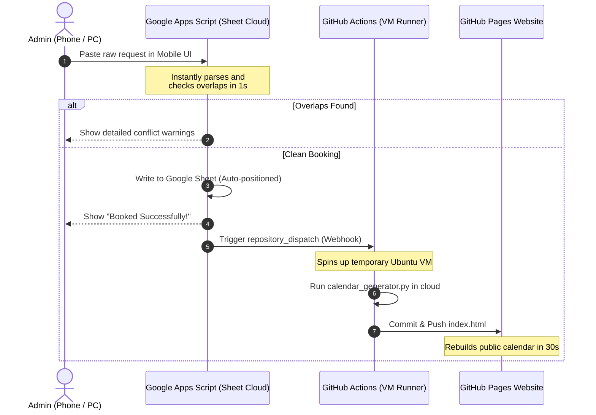

# TVKCC Facility Scheduler & Cloud Autopilot Automation (8/2026 - 7/2027)

A robust, enterprise-grade cloud automation system that coordinates the ingestion, overlap checking, layout formatting, and web publishing of church facility requests for the 8/2026 - 7/2027 planning year.

It features a **100% Serverless Autopilot Pipeline** that lets you check, book, and publish schedules directly from your smartphone's browser from anywhere in the world—with **$0.00 hosting costs** and **zero computer dependency**.

---

## 🌐 System Architecture & Cloud Pipelines

The system utilizes a high-efficiency division of labor between two cloud environments:



### 1. Google Sheets & Apps Script (The Brain)
* **Instant Overlap Checking**: Parses unstructured requests (Korean/English) and maps facilities (e.g. Gym ➡️ JP2). It expands recurring dates and validates them in the cloud, giving you **instant (1–2 seconds) feedback** on your phone.
* **Layout Formatting**: Automatically groups liturgy events under the "TVKCC Liturgy" header and other groups under "TVKCC Community Events".
* **The Webhook**: After a clean booking is saved, Apps Script makes an HTTP POST request to GitHub's API to trigger a deployment.

### 2. GitHub Actions & Pages (The Publisher)
* **On-Demand VM**: GitHub spins up a free virtual server whenever it receives the Apps Script webhook.
* **Calendar Generation**: The VM runs `calendar_generator.py` (written in Python) in the cloud, securely loading your spreadsheet's Web App URL from GitHub Secrets, compiles the new data, and overwrites the public `index.html` calendar grid.
* **Hosting**: The responsive calendar is served to your community members for free at **`https://youngkjoo.github.io/ses-schedule/`**!

---

## 🛠️ Autopilot Setup Instructions

Follow these steps to link your Google Sheet and GitHub account securely:

### Step 1: Add your Spreadsheet URL to GitHub Secrets
1. Go to your GitHub repository: [github.com/youngkjoo/ses-schedule](https://github.com/youngkjoo/ses-schedule)
2. Select **Settings** ➡️ **Secrets and variables** (left sidebar) ➡️ **Actions**.
3. Click the green **New repository secret** button.
4. Set the following fields:
   * **Name**: `WEB_APP_URL`
   * **Value**: *Your Google Apps Script Web App URL* (starts with `https://script.google.com/macros/s/...`)
5. Click **Add secret**.

---

### Step 2: Create a GitHub Personal Access Token (PAT)
To allow your Google Sheet to trigger the GitHub cloud VM, you need to create a secure access token:
1. Click your profile picture (top right of GitHub) ➡️ **Settings** ➡️ **Developer settings** (bottom left sidebar).
2. Select **Personal access tokens** ➡️ **Tokens (classic)**.
3. Click **Generate new token** ➡️ **Generate new token (classic)**.
4. Set the following:
   * **Note**: `Google Sheet Autopilot Webhook`
   * **Expiration**: `No expiration` (recommended so it stays active)
   * **Scopes**: Check the **`repo`** checkbox (this is the only permission needed).
5. Click **Generate token** and **copy the token immediately** (it will look like `ghp_...`). *You won't see it again!*

---

### Step 3: Save the Access Token in your Google Sheet
1. Open your Google Sheet, and select **Extensions** ➡️ **Apps Script**.
2. Click the gear icon (**Project Settings**) in the left sidebar.
3. Scroll down to **Script Properties** and click **Add script property**.
4. Set the following:
   * **Property**: `GITHUB_PAT`
   * **Value**: *Paste the Personal Access Token (`ghp_...`) you copied in Step 2.*
5. Click **Save script properties**.

*(By saving your token as a Script Property, it is stored securely in Google's cloud and is completely hidden from the code itself).*

---

## 🧪 Local Testing (Optional Reference)

If you ever want to run checks or sync data manually on your MacBook:

* **Ingest Raw Text locally**:
  ```bash
  python3 ingest.py
  ```
* **Verify Overlaps manually**:
  ```bash
  python3 main.py check --group "Sunday School" --event "Sports" --dates "Every Sat" --time "5 PM - 9 PM" --room "JP2"
  ```
* **Add Bookings manually**:
  ```bash
  python3 main.py add --group "Sunday School" --event "Sports" --dates "Every Sat" --time "5 PM - 9 PM" --room "JP2"
  ```
* **Run Unit Tests**:
  ```bash
  python3 tests.py
  ```
